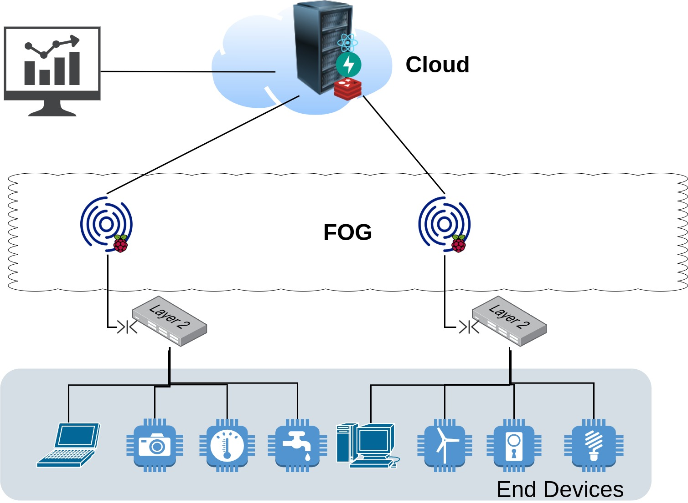

# IOT-GATE

(multidisciplinary project) IOT-GATE is an NIDS for IOT networks using machine learning.

## Architecture

On this project we wanted something light, fast and reliable so we chose the following architecture:

- Redis Streams: as a persistent data storage and it was chosen for it's producer/consumer pattern and it's log data structure with advanced operation.
- FastAPI: fast, simple and perfect as small microservice, which is necessary in our case.
- React js: fast light SPA with real-time data visualization.
- Raspberry pi: Cheap and easy to get/easy to deploy on a large scale.

